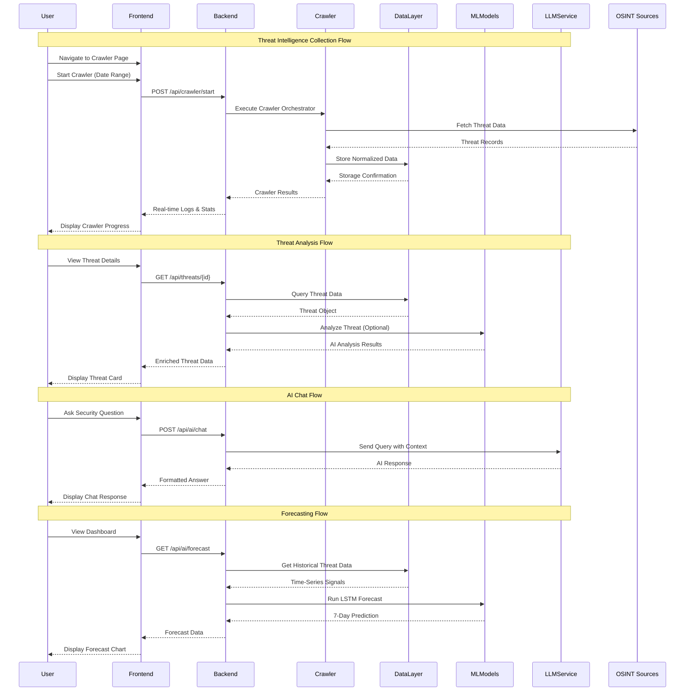
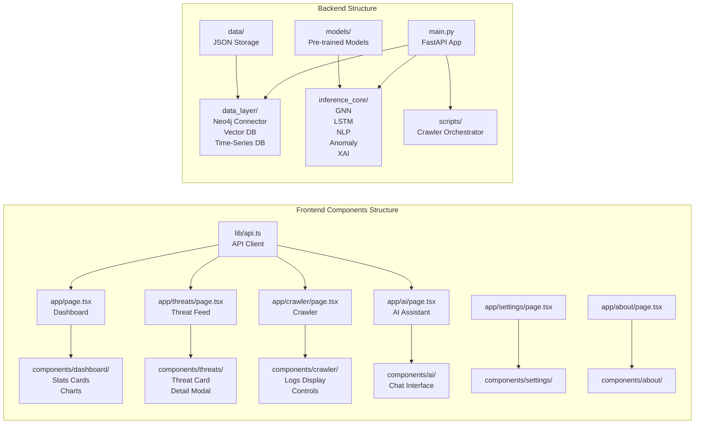
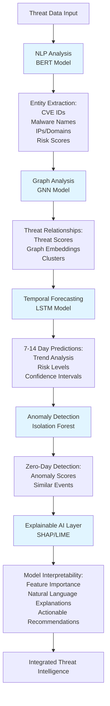
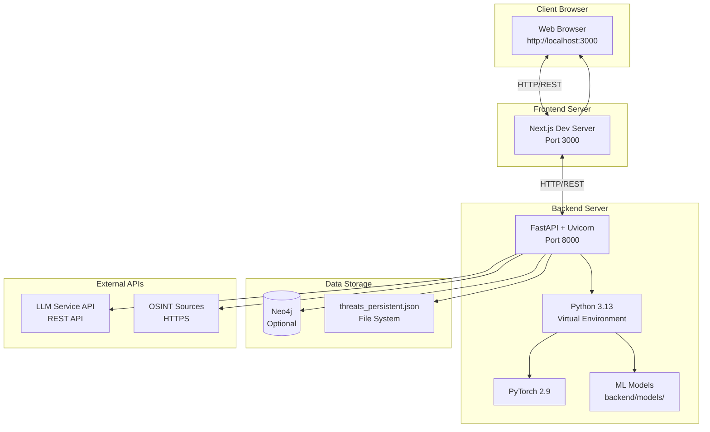
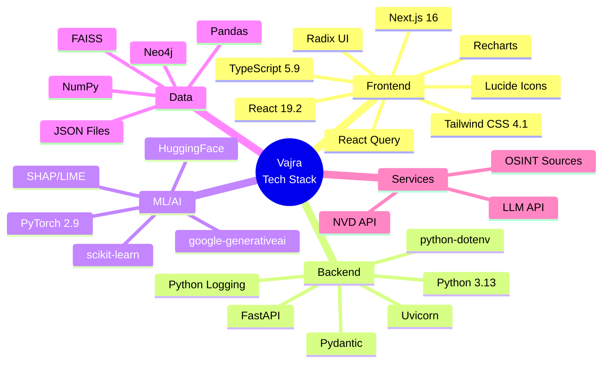
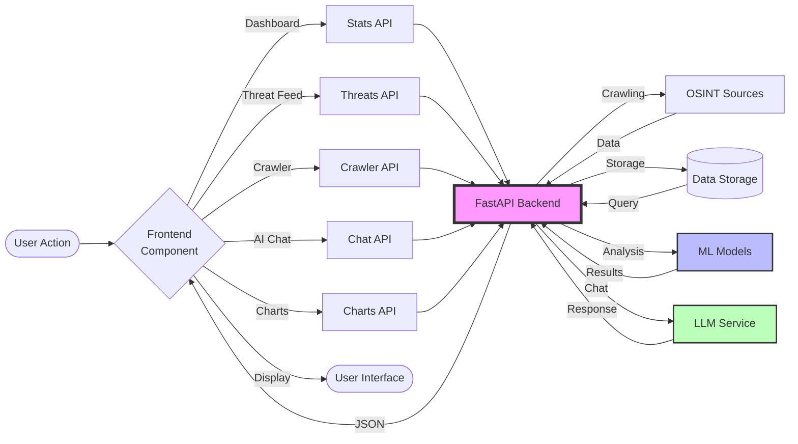

# Vajra System Architecture - Mermaid Diagrams

## High-Level System Architecture

```mermaid
graph TB
    subgraph "Frontend Layer - Next.js 16"
        UI[Dashboard/UI Components]
        Pages[Pages:<br/>Dashboard<br/>Threat Feed<br/>Crawler<br/>AI Assistant<br/>Settings<br/>About]
        Components[React Components:<br/>Charts<br/>Threat Cards<br/>Chat Interface<br/>Forms]
        UI --> Pages
        Pages --> Components
    end

    subgraph "Backend Layer - FastAPI + Python 3.13"
        API[API Routes<br/>main.py]
        API --> Stats[/api/stats]
        API --> Threats[/api/threats]
        API --> Search[/api/search]
        API --> Charts[/api/charts]
        API --> CrawlerEP[/api/crawler]
        API --> Export[/api/export]
        API --> ChatEP[/api/ai/chat]
        API --> ForecastEP[/api/ai/forecast]
        API --> AnalyzeEP[/analyze/*]
    end

    subgraph "AI/ML Inference Core"
        GNN[Graph Neural Network<br/>GNN Model<br/>92.3% Accuracy]
        LSTM[LSTM Temporal Forecaster<br/>88.7% Accuracy]
        NLP[BERT NLP Analyzer<br/>HuggingFace]
        Anomaly[Isolation Forest<br/>Anomaly Detector]
        XAI[Explainable AI<br/>SHAP/LIME]
        
        AnalyzeEP --> GNN
        AnalyzeEP --> LSTM
        AnalyzeEP --> NLP
        AnalyzeEP --> Anomaly
        AnalyzeEP --> XAI
    end

    subgraph "Crawler System"
        Orchestrator[Crawler Orchestrator<br/>crawler_orchestrator.py]
        NVD[NVD Crawler]
        CISA[CISA KEV Crawler]
        GitHub[GitHub Security Crawler]
        Reddit[Reddit /r/netsec Crawler]
        ExploitDB[Exploit-DB Crawler]
        AbuseCH[Abuse.ch Crawlers]
        MalwareBz[MalwareBazaar Crawler]
        
        CrawlerEP --> Orchestrator
        Orchestrator --> NVD
        Orchestrator --> CISA
        Orchestrator --> GitHub
        Orchestrator --> Reddit
        Orchestrator --> ExploitDB
        Orchestrator --> AbuseCH
        Orchestrator --> MalwareBz
    end

    subgraph "AI Chat Service"
        ChatHandler[Chat Handler<br/>LLM Integration]
        LLM[Large Language Model<br/>via REST API]
        PromptEngine[Security-Focused<br/>Prompt Engine]
        
        ChatEP --> ChatHandler
        ChatHandler --> PromptEngine
        PromptEngine --> LLM
        LLM --> ChatHandler
    end

    subgraph "Data Layer"
        Neo4j[(Neo4j Graph DB<br/>Optional)]
        JSON[JSON File Storage<br/>threats_persistent.json]
        Memory[In-Memory<br/>Simulation]
        
        Orchestrator --> Neo4j
        Orchestrator --> JSON
        Orchestrator --> Memory
        API --> Neo4j
        API --> JSON
        API --> Memory
    end

    subgraph "ML Models Storage"
        Models[Pre-trained Models:<br/>gnn_model.pt<br/>lstm_model.pt<br/>anomaly_detector.joblib<br/>BERT Cache]
        
        GNN --> Models
        LSTM --> Models
        NLP --> Models
        Anomaly --> Models
    end

    subgraph "External Services"
        OSINTSources[OSINT Sources:<br/>nvd.nist.gov<br/>cisa.gov/kev<br/>github.com/security<br/>reddit.com/r/netsec<br/>exploit-db.com<br/>abuse.ch<br/>malwarebazaar.abuse.ch]
    end

    Components -->|HTTP/REST API| API
    OSINTSources -->|HTTPS| Orchestrator
```

## Data Flow Architecture



## Component Architecture



## AI/ML Pipeline Architecture



## Deployment Architecture



## Technology Stack Diagram



## System Integration Flow



